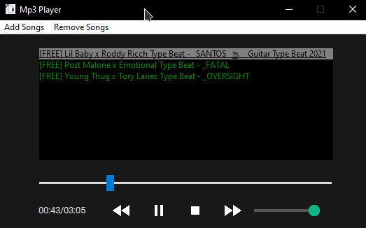

# Mp3 Player app with Tkinter GUI in Python
## About
> This App is an open-source project which you can listen songs from your computer.
> Currently, you can only play mp3 files.
***

# How to run
* First, clone the repository
* Second, make sure you have all the dependencies installed (run 'requirements.bat' to verify)
* Third, go intro repository and run `python player.py`
* Enjoy!
***

## Features to be added and modified
- [ ] Adding shuffle function
- [ ] Adding queue function
- [ ] Adding more compatibility  files
- [ ] Rename/Delete buttons and many features

###### ❤️ love u guys please follow me on github and star this project ;)**
